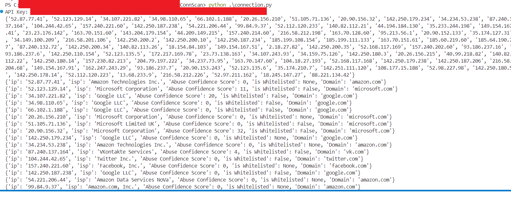
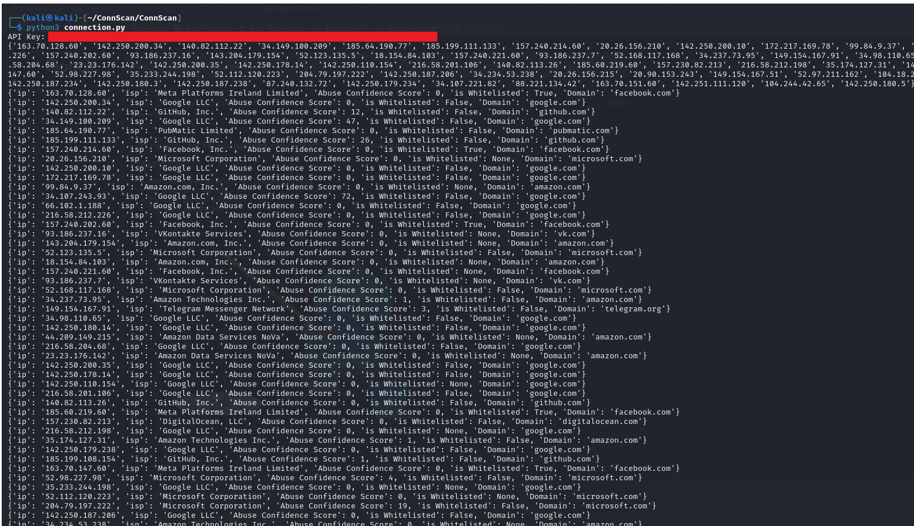

# ConnScan
Application package library, which gathers network connection information - IPs and hosts


Install requirements:


```
pip install -r requirements.txt
```

Usage:

```
python connection.py
```

# Example output:

tested on Windows platform:


tested on Linux platform:

